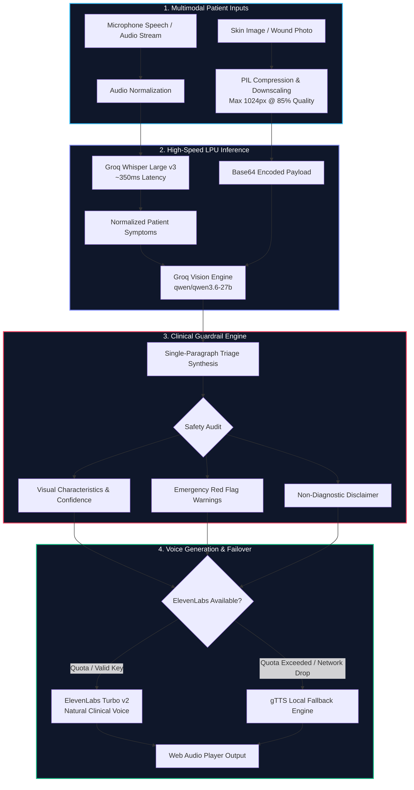

<div align="center">

# Vital-Lens
### Real-Time Multimodal Clinical Triage & Telehealth Assistant

[](https://medic-t279.onrender.com/)
[](https://www.python.org/)
[](https://groq.com/)
[](https://groq.com/)
[](https://elevenlabs.io/)
[](https://pypi.org/project/gTTS/)
[](LICENSE)

<p align="center">
  <b>Sub-second speech-to-text transcription, dermatological image analysis, structured clinical triage synthesis, and low-latency voice response with automated failover.</b>
</p>

[**Live Demo**](https://medic-t279.onrender.com/) | [**Architecture**](#multimodal-pipeline-architecture) | [**Clinical Guardrails**](#clinical-prompting--guardrails) | [**Engineering Highlights**](#engineering-highlights) | [**Quickstart**](#quickstart)

</div>

---

## Overview & Clinical Intent

Telehealth triage often suffers from high user friction: typing long symptom descriptions on mobile keyboards is error-prone, and raw text diagnostic summaries can be confusing or alarmist.

**Vital-Lens** delivers a conversational, multimodal triage assistant engineered for accessible preliminary assessments:
1. **Verbal Symptom Capture**: Natural conversational speech input transcribed via Groq LPU Whisper in ~350ms, with manual text fallbacks.
2. **Visual Dermatological Inspection**: Patient wound or skin condition imagery (acne, eczema, dandruff, lesions) downsampled and inspected via `qwen/qwen3.6-27b` multimodal vision.
3. **Structured Clinical Synthesis**: Formats findings into a concise, non-alarmist single paragraph covering condition likelihood, clinical visual features, percentage confidence, safe home care, and emergency red flags.
4. **Natural Audio Synthesis**: Generates conversational spoken diagnoses via ElevenLabs Turbo v2 with automated failover to gTTS.

---

## Multimodal Pipeline Architecture



---

## Clinical Prompting & Guardrails

To prevent medical liability, panic-inducing hallucinations, and unformatted data dumps, the vision model is bounded by a strict clinical operational contract (`brain.py`):
* **Single Paragraph Constraint**: Guarantees concise delivery under 100 words so patient guidance remains legible and digestible.
* **Non-Definitive Phrasing**: Forbids declarative claims like *"You have eczema"*; enforces probabilistic phrasing: *"With what I see, the visible presentation suggests..."*
* **Emergency Red Flags**: Mandates explicit triage warnings (e.g. spreading redness, systemic fever, severe pain) directing users to immediate emergency care when visual indicators suggest acute infection.
* **Mandatory Medical Disclaimer**: Every assessment explicitly asserts it is an informational AI triage aid, not a certified clinical diagnosis.

---

## Engineering Highlights

### 1. In-Flight Image Downscaling & Latency Optimization (`brain.py`)
High-resolution camera uploads (e.g. 12MP smartphone photos) cause memory spikes and API payload timeouts. Vital-Lens dynamically rescales input imagery before base64 encoding:
```python
def encode_image(image_path):
    """Downscale image to max 1024px @ 85% JPEG quality.
    Reduces payload size by ~85%, ensuring fast uploads and sub-2s Groq vision processing.
    """
    with Image.open(image_path) as img:
        img = img.convert("RGB")
        img.thumbnail((MAX_IMAGE_DIMENSION, MAX_IMAGE_DIMENSION))
        buffer = io.BytesIO()
        img.save(buffer, format="JPEG", quality=85)
    return base64.b64encode(buffer.getvalue()).decode("utf-8")
```

### 2. Thread-Safe Lazy Client Singletons
Avoids redundant client instantiations on concurrent incoming requests using double-checked thread locking:
```python
_client = None
_client_lock = threading.Lock()

def _get_client():
    global _client
    with _client_lock:
        if _client is None:
            _client = Groq(api_key=os.environ["GROQ_API_KEY"])
        return _client
```

### 3. Graceful Multi-Tier Audio Failover (`doctor.py`)
Ensures user never receives a silent failure if third-party audio quotas are exhausted:
```python
# Primary: High-fidelity natural voice
try:
    audio_stream = elevenlabs_client.generate(text=diagnosis, voice="Doctor")
except Exception:
    # Graceful automatic failover: Google TTS synthesis
    tts = gTTS(text=diagnosis, lang="en")
    tts.save("final.mp3")
```

---

## Quickstart

### Prerequisites
- Python 3.10+
- Free [Groq API Key](https://console.groq.com/keys) (required for STT + Vision)
- [ElevenLabs API Key](https://elevenlabs.io/) (optional; system automatically falls back to gTTS if omitted)

### 1. Clone & Environment Setup
```bash
git clone https://github.com/shehreenmansoori/Vital-Lens.git
cd Vital-Lens

python -m venv .venv
source .venv/bin/activate  # Windows: .venv\Scripts\activate
pip install -r requirements.txt
```

### 2. Configure Environment Variables
Create a `.env` file in the project root:
```env
GROQ_API_KEY=your_groq_api_key_here
ELEVENLABS_API_KEY=your_elevenlabs_api_key_here  # Optional
```

### 3. Launch Application
```bash
python app.py
```
Open [http://localhost:7860](http://localhost:7860) in your browser. Record voice symptoms, upload a sample skin condition image (or choose acne/dandruff presets), and review the spoken assessment.

---

## Repository Layout

```text
├── app.py           # Gradio web interface & multimodal input pipeline
├── brain.py         # Image downscaling, base64 encoding & Groq Vision reasoning
├── voice.py         # Speech-to-text transcription via Groq Whisper v3
├── doctor.py        # Dual-tier text-to-speech synthesis (ElevenLabs + gTTS)
├── requirements.txt # Pinned Python dependencies (pure-Python wheels)
├── .env.example     # Environment variable template
├── acne.jpg         # Sample test image
└── Dandruff.jpg     # Sample test image
```

---

## Medical Disclaimer

> [!IMPORTANT]
> **Vital-Lens is developed solely for educational and research prototyping purposes.** It is **not** a medical device, clinical diagnostic tool, or replacement for professional medical judgment. Always consult a board-certified physician or qualified healthcare provider for any health concern or diagnosis.


