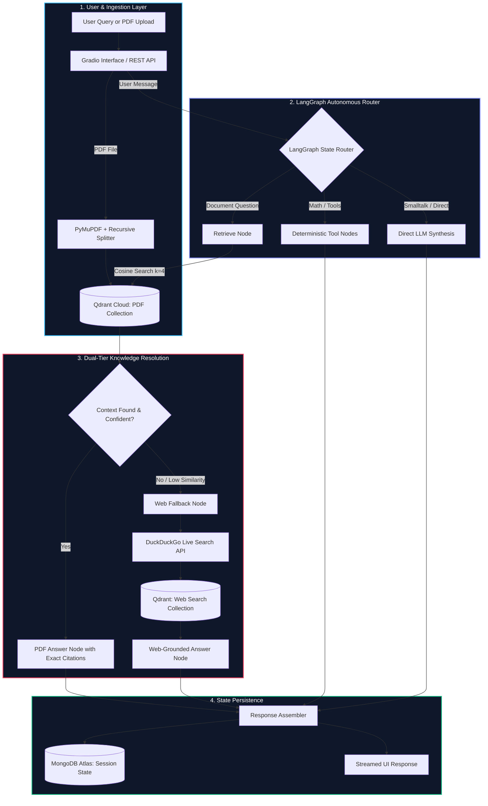
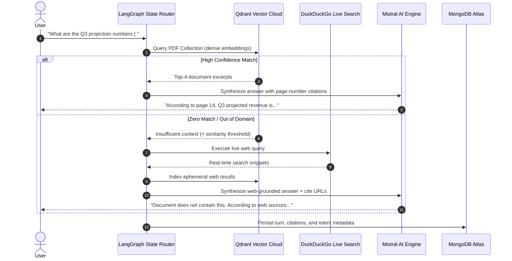

<div align="center">

# DocuMind
### Multi-Tool LangGraph Document Intelligence & Hybrid RAG Engine

[](https://www.python.org/)
[](https://langchain-ai.github.io/langgraph/)
[](https://qdrant.tech/)
[](https://www.mongodb.com/)
[](https://mistral.ai/)
[](https://duckduckgo.com/)
[](LICENSE)

<p align="center">
  <b>Hybrid document reasoning combining PyMuPDF chunking, dense vector retrieval, autonomous LangGraph tool routing, live web fallback, and MongoDB session persistence.</b>
</p>

[**Architecture**](#state-machine-architecture) | [**Hybrid Retrieval**](#dual-tier-retrieval--fallback) | [**Engineering Specs**](#engineering-specifications) | [**Quickstart**](#quickstart)

</div>

---

## Problem & Architecture Overview

Standard RAG pipelines break down in two common production scenarios:
1. **The Out-of-Domain Dead End**: When a user asks a question not contained in the uploaded PDF, standard RAG either hallucinates or unhelpfully asserts *"I don't know"*.
2. **Context Bleed & Session Loss**: Stateless chat interfaces lose user intent, file context, and conversational continuity across turns.

**DocuMind** solves this with an autonomous **LangGraph StateGraph** architecture:
* **Dynamic Intent Routing**: Routes incoming requests to dedicated tool nodes (system time, arithmetic, general dialogue) without polluting the vector retrieval pipeline.
* **Dual-Tier Retrieval with Web Fallback**: If retrieved document chunks score below confidence thresholds, the engine dynamically triggers a DuckDuckGo live search, vectorizes the search results on the fly, and synthesizes a grounded answer.
* **Dual-Collection Vector Segmentation**: Isolates uploaded PDF embeddings from ephemeral web search vectors in Qdrant to eliminate cross-domain contamination.
* **MongoDB Session Memory**: Persists conversation history, active document metadata, and session tokens across client restarts.

---

## State Machine Architecture



---

## Dual-Tier Retrieval & Fallback



---

## Engineering Specifications

| Layer | Technology | Architectural Role | :--- | :--- | :--- | **Agent Orchestration** | [LangGraph](https://langchain-ai.github.io/langgraph/) | Deterministic acyclic state routing with conditional branching | **Vector Engine** | [Qdrant Cloud](https://qdrant.tech/) | Production dense cosine similarity search (`mistral-embed`) | **Persistence** | [MongoDB Atlas](https://www.mongodb.com/) | User session history, conversation turns, and document logs | **Document Ingestion** | PyMuPDF (`fitz`) + Recursive Splitter | High-speed layout-aware PDF text and table extraction | **LLM Provider** | [Mistral AI](https://mistral.ai/) (`mistral-small-latest`) | Low-latency instruction-tuned reasoning and source citation | **Web Search Fallback**| `duckduckgo-search` | Live internet fallback when local document context is exhausted | **Frontend UI** | Gradio | Responsive UI with dark mode, drawer navigation, and settings |

---

## Quickstart

### 1. Prerequisites
- Python 3.10+
- Active accounts for Mistral AI, Qdrant Cloud, and MongoDB Atlas.

### 2. Clone & Install
```bash
git clone https://github.com/shehreenmansoori/Doc-Chatbot.git
cd Doc-Chatbot

python -m venv .venv
source .venv/bin/activate  # Windows: .venv\Scripts\activate
pip install -r requirements.txt
```

### 3. Configure Environment Variables
Create a `.env` file in the root directory:
```env
MISTRAL_API_KEY=your_mistral_api_key
QDRANT_URL=your_qdrant_cloud_endpoint
QDRANT_API_KEY=your_qdrant_api_key
MONGODB_URI=your_mongodb_atlas_connection_string
PORT=7860
```

### 4. Launch Service
```bash
python app.py
```
Access the application at [http://localhost:7860](http://localhost:7860).

---

## Cloud Deployment (Render / Docker)

The repository contains a native `render.yaml` configuration for automated deployment:
```yaml
services:
  - type: web
    name: doc-chatbot
    env: python
    buildCommand: pip install -r requirements.txt
    startCommand: python app.py
    envVars:
      - key: PORT
        value: 7860
```
The server dynamically binds to `0.0.0.0` on `$PORT` to ensure compatibility across cloud container runtimes.

---

## Repository Layout

```text
├── app.py           # Gradio application interface & LangGraph state machine
├── chunking.py      # PyMuPDF extraction & recursive character splitting
├── embedding.py     # Qdrant client connection & dense vector indexing
├── retreiver.py     # Multi-collection retrievers (PDF + Web collections)
├── mongo_db.py      # MongoDB Atlas session persistence & chat logging
├── main.py          # Alternative headless FastAPI backend endpoints
├── requirements.txt # Pinned production Python dependencies
└── render.yaml      # Render infrastructure-as-code deployment manifest
```

---

## License
Distributed under the [MIT License](LICENSE).


