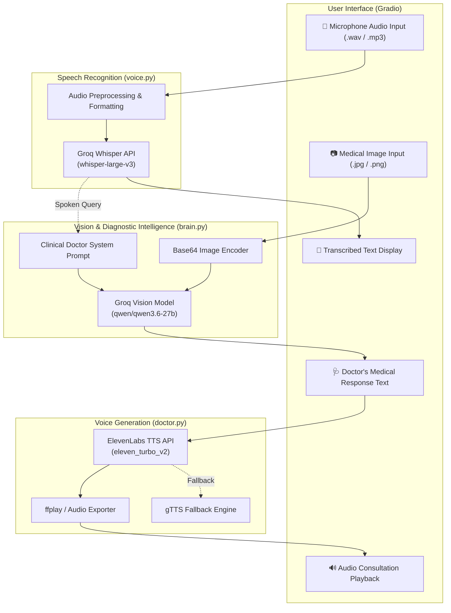

# medic 🩺

An intelligent, multimodal AI medical assistant combining voice transcription, vision-based image analysis, and synthetic speech generation to simulate real-time telehealth consultations.

---

## 📌 Overview

**medic** provides an interactive web interface powered by Gradio where patients can upload or capture medical images (e.g., skin conditions, rash, eye irritations) and describe their symptoms using spoken voice. The pipeline processes spoken audio via **Groq Whisper**, interprets visual symptoms using **Groq Vision LLMs**, and synthesizes an empathetic, professional spoken clinical response via **ElevenLabs** (with gTTS fallback).

---

## 🏗️ Architecture & Dataflow



---

## ✨ Features

- **🎙️ Speech-to-Text Transcription**: Fast, accurate speech transcription powered by `whisper-large-v3` via Groq Cloud.
- **👁️ Multimodal Visual Diagnosis**: Vision reasoning via Groq LLMs (`qwen/qwen3.6-27b` / Llama Vision) analyzing uploaded images.
- **🗣️ Natural Voice Synthesis**: Human-like doctor voice synthesis using ElevenLabs with automatic gTTS fallback.
- **🌐 Interactive Web Interface**: Clean Gradio interface supporting direct microphone capture and drag-and-drop image uploads.
- **🛡️ Secure Credential Management**: Protected environment configuration avoiding credential leaks.

---

## 📂 Project Structure

```text
medic/
├── app.py              # Main Gradio application & workflow orchestrator
├── brain.py            # Vision analysis and Groq LLM integration
├── doctor.py           # Text-to-speech generation (ElevenLabs & gTTS)
├── voice.py            # Audio recording and speech-to-text transcription
├── requirements.txt    # Python dependencies
├── .env.example        # Environment variable template
├── .gitignore          # Security and build exclusions
├── acne.jpg            # Sample test image
└── Dandruff.jpg        # Sample test image
```

---

## 🚀 Getting Started

### 1. Prerequisites
- **Python 3.10+** (Python 3.10 – 3.13 supported)
- **FFmpeg**: Required for audio format conversion and playback (`ffplay`).
  - **Windows**: Install via `winget install Gyan.FFmpeg` or download from [ffmpeg.org](https://ffmpeg.org/download.html).
  - **macOS**: `brew install ffmpeg`
  - **Linux**: `sudo apt update && sudo apt install ffmpeg`

### 2. Clone the Repository
```bash
git clone https://github.com/your-username/medic.git
cd medic
```

### 3. Set Up Virtual Environment (Optional but Recommended)
```bash
python -m venv .venv
# On Windows:
.venv\Scripts\activate
# On Linux/macOS:
source .venv/bin/activate
```

### 4. Install Dependencies
```bash
pip install -r requirements.txt
```

### 5. Configure API Keys
Create a `.env` file in the root directory by copying `.env.example`:
```bash
cp .env.example .env
```
Open `.env` and fill in your API keys:
```env
GROQ_API_KEY=gsk_your_groq_api_key_here
ELEVENLABS_API_KEY=your_elevenlabs_api_key_here
```
- [Get Groq API Key](https://console.groq.com/keys)
- [Get ElevenLabs API Key](https://elevenlabs.io/)

---

## 🖥️ Running the Application

Launch the Gradio interface:
```bash
python app.py
```

Once started, navigate to `http://127.0.0.1:7860` in your web browser.

1. **Microphone**: Record your voice describing the symptoms or question.
2. **Image**: Upload a clear image of the visible condition (or try sample images `acne.jpg` / `Dandruff.jpg`).
3. **Submit**: Click submit to view the transcription, clinical analysis, and listen to the doctor's audio diagnosis.

---

## ⚠️ Medical Disclaimer

> [!WARNING]
> **medic** is developed solely for educational, informational, and research purposes. It is **not** a certified medical diagnostic device and does **not** provide professional medical advice, diagnosis, or treatment. Always seek the advice of a qualified physician or other licensed healthcare provider with any questions you may have regarding a medical condition. Never disregard professional medical advice or delay seeking it because of something generated by this software.
